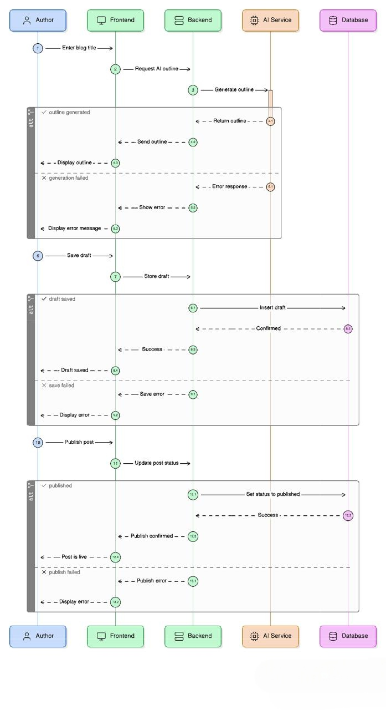

# 🔄 Sequence Diagram – Blog Creation with AI Assistance

## Main Flow: Author Creates Blog with AI

Actor: Author
System Components:
- Frontend (Next.js)
- Backend API (Express)
- AI Service
- Database (PostgreSQL)

---

1. Author opens Blog Editor.
2. Author enters blog title.
3. Author clicks "Generate Outline".

Frontend → Backend: POST /ai/generate-outline
Backend → AI Service: Send title prompt
AI Service → Backend: Return outline
Backend → Frontend: Send outline
Frontend → Author: Display generated outline

4. Author edits content.
5. Author clicks "Save Draft".

Frontend → Backend: POST /posts
Backend → Database: Save draft
Database → Backend: Confirmation
Backend → Frontend: Draft saved

6. Author clicks "Publish".

Frontend → Backend: PATCH /posts/:id/publish
Backend → Database: Update status to "Published"
Database → Backend: Success
Backend → Frontend: Publish confirmation

7. Post appears in public feed.

Frontend → Backend: GET /posts
Backend → Database: Fetch published posts
Database → Backend: Return posts
Backend → Frontend: Send blog list
Frontend → Reader: Display post

## Sequence Diagram 

