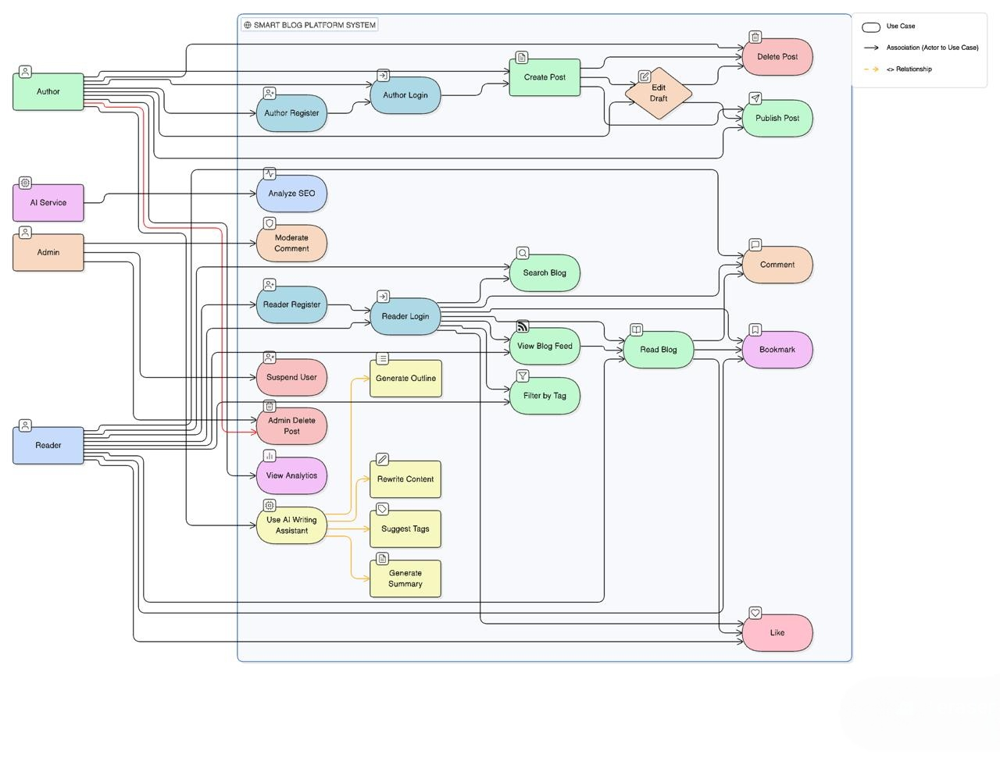

# 📌 Use Case Diagram – Smart Blog Platform

## Actors

1. Author
2. Reader
3. Admin
4. AI Service (External System)

---

## Author Use Cases

- Register
- Login
- Create Blog Post
- Edit Draft
- Publish Post
- Delete Post
- Generate AI Outline
- Rewrite Content using AI
- Generate Summary
- View Analytics
- Respond to Comments

---

## Reader Use Cases

- Register
- Login
- View Blog Feed
- Search Blogs
- Filter by Tags
- Read Blog
- Comment on Blog
- Bookmark Blog
- Like Blog

---

## Admin Use Cases

- Login
- Moderate Comments
- Delete Posts
- Suspend Users

---

## AI Service Use Cases

- Generate Outline
- Rewrite Paragraph
- Suggest Tags
- Generate Summary
- Analyze SEO Score

---

## Diagram (Textual Representation)

Author → (Create Post)
Author → (Use AI Writing Assistant)
Reader → (Read Post)
Reader → (Comment)
Admin → (Moderate Content)
System → AI Service (Generate Content Assistance)

## Use Case Diagram 

